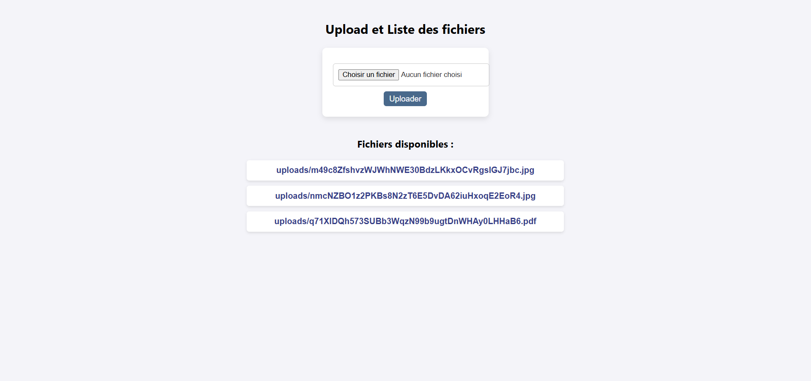

# Gestion des fichiers avec API Laravel et Frontend JavaScript

## Description
Cet exercice permet de créer une application simple permettant de télécharger et récupérer des fichiers via une API Laravel en utilisant JavaScript asynchrone pour le frontend.

## Fonctionnalités
- **Téléchargement de fichiers** : Envoi de fichiers à l'API Laravel via une requête `POST`.
- **Affichage des fichiers disponibles** : Récupération de la liste des fichiers stockés via une requête `GET`.
- **Interaction asynchrone** : Utilisation de `fetch` et des `Promises` pour gérer les requêtes et les réponses.

## Technologies utilisées
- **Backend** : Laravel 8+
- **Frontend** : JavaScript, HTML, CSS
- **Base de données** : Stockage local avec Laravel Filesystem

## Installation
### Prérequis
- PHP 8+
- Composer
- Node.js (optionnel pour le frontend)
- Laravel installé
- Un serveur local 

### Étapes d'installation
1. **Cloner le projet**
   ```sh
   git clone https://github.com/Lorraine301/Atelier5_Exercice2_Fichiers.git
   ```

2. **Installer les dépendances Laravel**
   ```sh
   composer install
   ```


3. **Démarrer le serveur Laravel**
   ```sh
   php artisan serve
   ```

4. **Démarrer le frontend**
   - Ouvrir `index.html` dans un navigateur
   - Ou utiliser un serveur local comme Live Server pour afficher l'interface

## Utilisation
### API Endpoints
#### 1. Upload d'un fichier
- **Méthode** : `POST`
- **URL** : `/api/upload`
- **Paramètres** :
  - `file` (fichier à uploader)
- **Réponse** : JSON contenant le chemin du fichier enregistré

#### 2. Récupération des fichiers
- **Méthode** : `GET`
- **URL** : `/api/files`
- **Réponse** : JSON contenant la liste des fichiers

#### 3. Suppression d'un fichier (optionnel)
- **Méthode** : `DELETE`
- **URL** : `/api/delete`
- **Paramètres** :
  - `filename` (nom du fichier à supprimer)

## Captures d'écran
Voici l'interface utilisateur pour illustrer l'application:



## Structure du projet
```
/laravel-backend
├── app/Http/Controllers/FileController.php  # Contrôleur API
├── routes/api.php                           # Routes API
├── storage/app/public/uploads/             # Dossier des fichiers
/frontend
├── index.html                              # Interface utilisateur
├── assets/script.js                        # Gestion des requêtes API
├── assets/style.css                        # Styles CSS
```

## Auteur
- **Nom** : RAHELIARISOA Andriamasy Lorraine Agnès
- **GitHub** : Lorraine301

## Licence
Cet exercice est sous licence MIT.

